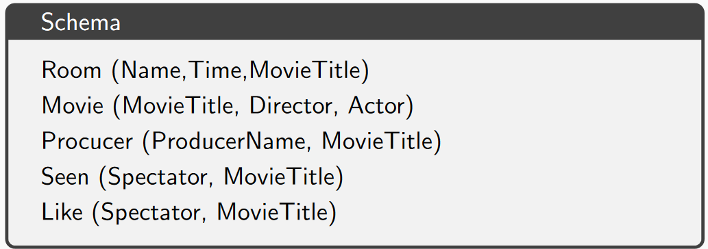

# Exercices

Author: William Liaw

## Schema



## Exercice 1


1. Where and when can we see the movie “Mad Max...”?

   ```
   solution = DROP(FILTER(Room, MovieTitle = "Mad Max"), MovieTitle)
   ```

2. What are the movies directed by Welles?

   ```
   solution = DROP(FILTER(Movie, Director = "Welles"), [Director, Actor])
   ```

3. Who are the actors of “Ran”?

   ```
   solution = DROP(FILTER(Movie, MovieTitle = "Ran"), [MovieTitle, Director])
   ```

4. Where can we see a movie in which Signoret plays?

   ```
   solution = DROP(FILTER(JOIN(Room, Movie, Room.MovieTitle = Movie.MovieTitle), Actor = "Signoret"), [Time, MovieTitle, Director, Actor])
   ```

5. Among the actors who produced at least one movie?

   ```
   solution = DROP(JOIN(Movie, Producer, Movie.Actor = Producer.ProducerName), [MovieTitle, Director, Actor])
   ```

6. Among the actors who directed a movie that they played in?

   ```
   solution = DROP(FILTER(Movie, Director = Actor), [MovieTitle, Director])
   ```

7. Who plays in one (or more) movie from Varda?

   ```
   solution = DROP(FILTER(Movie, Director = "Varda"), [MovieTitle, Director])
   ```

## Exercice 2

1. Who are the actors playing in all the films from Chloé Zhao?

   ```
   moviesZhao = DROP(FILTER(Movie, Director = "Chloé Zhao"), [Director, Actor])
   actors = DROP(Movie, [MovieTitle, Director])
   pairs = PRODUCT(moviesZhao, actors)
   missing = DIFFERENCE(pairs, Movie)
   solution = DIFFERENCE(actors, missing)
   ```

2. Who produces all the movies from Kurosawa?

   ```
   moviesKurosawa = DROP(FILTER(Movie, Director = "Kurosawa"), [Director, Actor])
   producers = DROP(Producer, MovieTitle)
   pairs = PRODUCT(moviesKurosawa, producers)
   missing = DIFFERENCE(pairs, Producer)
   solution = DIFFERENCE(Producer, missing)
   ```

3. Who are the spectators watching all the movies?

   ```
   movieTitles = DROP(Movie, [Director, Actor])
   spectators = DROP(Seen, MovieTitle)
   pairs = PRODUCT(spectators, movieTitles)
   missing = DIFFERENCE(pairs, Seen)
   solution = DIFFERENCE(Seen, missing)
   ```

4. Among the spectators, who likes all the movies they see?

   ```
   movieTitles = DROP(Movie, [Director, Actor])
   likers = DROP(Like, MovieTitle)
   pairs = PRODUCT(likers, movieTitles)
   missing = DIFFERENCE(pairs, Like)
   solution = DIFFERENCE(Like, missing)
   ```

5. Where can we see Adèle Haenel after 16:00?

   ```
   movieTitles = DROP(Movie, [Director, Actor])
   moviesAdele = DROP(FILTER(Movie, Actor = "Adèle Haenel"), [Director, Actor])
   roomsAfter16 = DROP(FILTER(Room, Time > 16), Time)
   solution = DROP(JOIN(moviesAdele, roomsAfter16, moviesAdele.MovieTitle = roomsAfter16.MovieTitle), MovieTitle)
   ```

6. What are the movies with no room projecting them?

   ```
   movieTitles = DROP(Movie, [Director, Actor])
   rooms = DROP(Room, [Time, MovieTitle])
   pairs = PRODUCT(movieTitles, rooms)
   missing = DIFFERENCE(pairs, Room)
   solution = DROP(missing, Name)
   ```

## Exercice 3

1. Among the producers, who produces a movies shown nowhere?

   ```
   movieTitles = DROP(Movie, [Director, Actor])
   rooms = DROP(Room, [Time, MovieTitle])
   pairs = PRODUCT(movieTitles, rooms)
   missing = DIFFERENCE(pairs, Room)
   movieNoRoom = DROP(missing, Name)
   solution = DROP(JOIN(movieNoRoom, Producer, movieNoRoom.MovieTitle = Producer.MovieTitle), ProducerName)
   ```

2. Among the producers, who saw all the movies they directed?

   ```
   producers = DROP(Producer, MovieTitle)
   spectators = DROP(Seen, MovieTitle)
   pairs = PRODUCT(producers, spectators)
   prodSpec = JOIN(Producer, Seen, Producer.MovieTitle = Seen.MovieTitle)
   missing = DIFFERENCE(pairs, prodSpec)
   solution = DROP(DIFFERENCE(pairs, missing), MovieTitle)
   ```

3. Among the spectators, who saw all the movies from Kurosawa?

   ```
   moviesKurosawa = DROP(FILTER(Movie, Director = "Kurosawa"), [Director, Actor])
   spectators = DROP(Seen, MovieTitle)
   pairs = PRODUCT(spectators, moviesKurosawa)
   missing = DIFFERENCE(pairs, Seen)
   solution = DIFFERENCE(Seen, missing)
   ```

4. Among the spectators, who liked a movie they did not watch?

   ```
   seenLike = JOIN(Seen, Like, Seen.Spectator = Like.Spectator)
   solution = DROP(DIFFERENCE(Like, seenLike), MovieTitle)
   ```

5. Among the spectators, who liked 0 movies?

   ```
   seenLike = JOIN(Seen, Like, Seen.Spectator = Like.Spectator)
   solution = DROP(DIFFERENCE(Seen, seenLike), MovieTitle)
   ```
